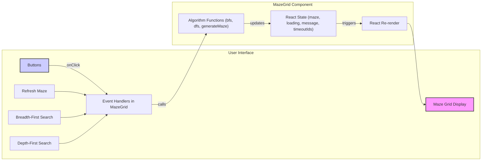

# Application Architecture

This document outlines the architecture of the Maze Pathfinder Visualizer application.

## 1. Overview

The Maze Pathfinder Visualizer is a client-side single-page application (SPA) built with React and Vite. It runs entirely in the user's web browser. The architecture is centered around a main React component (`MazeGrid`) that manages the application's state and logic, including maze generation, pathfinding algorithms, and visualization rendering.

## 2. Project Folder Structure

```
pathfinder_visualizer_kartikey/
├── README.md           # Project overview, setup, usage (This file)
├── index.html          # Main HTML entry point, container for React app
├── package.json        # Project metadata, dependencies, scripts
├── tsconfig.json       # TypeScript configuration (project is JS but TS-ready)
├── vite.config.js      # Vite build tool configuration
├── .replit             # Replit specific configuration (if used)
├── public/             # Static assets (e.g., favicon.png)
│   └── favicon.png
└── src/                # Source code for the React application
    ├── App.css         # CSS styles for the application components
    ├── index.jsx       # Entry point for the React application, renders MazeGrid
    └── MazeGrid.jsx    # Core component handling logic and rendering
```

## 3. Major Components

The application consists primarily of one major component:

- **`MazeGrid.jsx`**:

  - **Responsibilities**:
    - **State Management**: Holds the primary application state using `useState` hooks:
      - `maze`: A 2D array representing the grid, storing the type of each cell ('wall', 'path', 'start', 'end', 'visited').
      - `loading`: Boolean flag to indicate if the maze is currently being generated.
      - `message`: String to display status messages (e.g., "Path found!").
      - `timeoutIds`: An array storing IDs of scheduled `setTimeout` calls for visualization cleanup.
    - **Maze Generation**: Contains the `generateMaze` function implementing the recursive backtracking algorithm. Updates the `maze` state upon completion.
    - **Pathfinding Algorithms**: Implements `bfs` (Breadth-First Search) and `dfs` (Depth-First Search) functions.
    - **Visualization Logic**: Integrates `setTimeout` within the pathfinding algorithms' step functions to create delays and update the `maze` state incrementally, triggering re-renders for visualization.
    - **Rendering**: Maps the `maze` state to JSX elements, rendering the grid structure and applying appropriate CSS classes (`.cell`, `.wall`, `.visited`, etc.) based on the cell state.
    - **Event Handling**: Manages button clicks ("Refresh Maze", "Breadth-First Search", "Depth-First Search") to trigger corresponding actions (maze generation, algorithm execution).
  - **Props**: Accepts optional `width` and `height` props to define the grid size (defaults to 20x20).

- **`index.jsx`**:
  - The root rendering file for React. It imports `MazeGrid` and renders it into the 'root' DOM element defined in `index.html`.

## 4. Data Flow

The application follows a unidirectional data flow typical of React applications:

1.  **Initialization**:

    - `index.jsx` renders the `MazeGrid` component.
    - `MazeGrid`'s `useEffect` hook calls `generateMaze` on mount, creating the initial maze state.
    - The initial `maze` state is rendered as the grid.

2.  **User Interaction (Button Click)**:

    - User clicks a button (e.g., "Breadth-First Search").
    - The `onClick` handler attached to the button in `MazeGrid` is triggered.
    - The handler calls the corresponding function (`bfs`, `dfs`, or `refreshMaze`).

3.  **Algorithm Execution & State Updates**:

    - **`refreshMaze`**: Clears existing timeouts, calls `generateMaze`, which updates the `maze` state directly and resets `loading` and `message`.
    - **`bfs`/`dfs`**:
      - Initialize algorithm variables (queue/stack, visited set).
      - Start the recursive `step` function.
      - Inside `step`:
        - Process a cell.
        - Identify valid neighbors.
        - For each neighbor to visit/explore: call `setMaze` to update the cell's status to 'visited'. This triggers a re-render.
        - Schedule the next call to `step` using `setTimeout`, storing the timeout ID in the `timeoutIds` state.

4.  **Rendering**:
    - Whenever the `maze` state (or other states like `loading`, `message`) is updated via `setMaze`, React detects the change.
    - React re-renders the `MazeGrid` component and its children.
    - The updated grid reflects the new cell states (e.g., newly visited cells change color).
    - CSS rules in `App.css` define the appearance of cells based on their state classes.



_Diagram: Simplified Data Flow_

## 5. Key Design Decisions

- **Component-Based Architecture**: Using React components encapsulates UI and logic, making the code modular.
- **Functional Components & Hooks**: Utilizing modern React features (`useState`, `useEffect`) for state management and lifecycle events in functional components.
- **Client-Side Logic**: All maze generation and pathfinding logic runs directly in the browser, simplifying deployment (static hosting) and providing immediate interactivity.
- **State-Driven Visualization**: The visualization relies on updating the component's state (`maze`) progressively. This leverages React's rendering mechanism but tightly couples the algorithm logic with state updates.
- **`setTimeout` for Animation**: Using `setTimeout` provides a simple way to introduce delays for visualization. While effective for moderate speeds/sizes, it can be less precise than `requestAnimationFrame` for high-performance animations and doesn't automatically adjust to frame rates.
- **CSS for Styling**: Standard CSS is used for styling the grid and cell states, including responsive cell sizing using CSS variables (`--cell-size`).
- **In-Component Algorithms**: BFS, DFS, and maze generation logic are implemented directly within the `MazeGrid` component. For larger applications, these might be extracted into separate utility modules.
